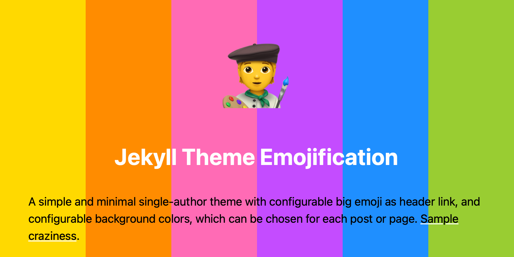

# 🤩 Jekyll Theme Emojification 🤩

A simple and minimal single-author theme with configurable big emoji as the header link, and configurable background colors, which can be chosen for each post or page.

[Demo site with examples](https://jekyll-theme-emojification.michaelnordmeyer.com/)

The demo site has useful samples and shows how many color/emoji combinations are possible.

## Compatibility

Compatible with Jekyll >= 3.9.3 and GitHub Pages.

## Limited, But Useful Features

- Clean, minimalist design
  - Single-column
  - Single-author
  - No visible authors, categories, or tags on posts or pages
  - No header or footer
  - No pagination for the home page to effectively be the archive and allow for searching all titles in-browser
- Posts
- Pages
- Category pages
- A styled redirection page, which will be used by the optional plugin [Jekyll Redirect From](https://github.com/jekyll/jekyll-redirect-from)
- Theme-color matching favicons
- Header images
- Optional excerpts in feed, SEO tags, category and home pages
- Content warnings for embedded videos
- Hidden semantic info for embedding and SEO like Open Graph, JSON-LD, and inline Microdata. No need for the `jekyll-seo-tag` plugin
- Minimal build and load times
- Custom header and footer to add snippets
- Cache buster for CSS and favicon files
- Basic [Webmention](https://indieweb.org/Webmention) support (needs third-party service like [Webmention.io](https://webmention.io) or additional server software), which allows subscribing to a feed of Webmentions, which are cross-site notifications

## Additional Features

Some features cannot applied automatically due to how Jekyll integrates remote themes. They have to be copied manually and are included in the demo repository.

- Category pages
- Custom error pages
- An in-browser styled Atom feed through a feed XSLT, which is automatically applied by the `jekyll-feed` plugin. It educates people about feeds.
- An in-browser styled sitemap through a sitemap XSLT, which is automatically applied by the `jekyll-sitemap` plugin. Probably only the site owner might look at it every once in a while.

## Minutiae

### Category Navigation Links

For categories to be properly linked, the site needs a `category` directory having separate markdown files for each category. E.g. for the category "Features" a file called `features.md` in the directory `category` with the following content:

```yaml
---
title: "Features"
excerpt: A description for the head's meta description tag created by this theme
permalink: /category/features
sitemap: false
layout: category
---
```

The title and permalink have to match the corresponding filename and category name. Permalink, sitemap, and layout can be declared in `_config.yml` to void repetition.

```yaml
defaults:
  - scope:
      path: "category"
      type: pages
    values:
      layout: category
      permalink: /:path/:basename
      sitemap: false
```

Used categories have to be linked manually, because there is no menu.

### Header Image Support

A header image is displayed after the title on posts and pages, if `image` is added to the file's frontmatter.

```yaml
---
image:
  path: /images/sample-image.jpg
  alt: The description of the image
  title: The title of the image
---
```

This image is also used in `feed.xml` and SEO tags as the displayed image.

### Excerpts

The excerpts are declared in the post's frontmatter:

```yaml
excerpt: "A helpful excerpt."
```

They should be limited to 160 characters, because some of the places where they are used are effectively limited in length. If no excerpts are declared, then Jekyll will create one automatically.

#### Enabling Excerpts on the Home Page

To display post excerpts on the home page, simply add the following to your `_config.yml`:

```yaml
theme_settings:
  show_excerpts: true
```

### Favicons

There can be several favicons for a site running this theme, because it is possible to use different background colors, and the favicon should reflect the color theme. But there is also a site-wide favicon, which should reflect the style of the home page, and is used in the Atom feed.

Icons should be named `<color>.webp` without the preceding hash of a hex color, be in `webp` format at 180×180 resolution, and be located in `/assets/icons/`. [Theme-matching icons can be easily generated from Unicode glyphs](https://michaelnordmeyer.com/generating-favicons-from-unicode-glyphs), if custom colors are used. Icons for the default theme colors are included.

### Styled Atom Feed and Sitemap.xml

For a standard Jekyll installation, they work out-of-the-box if the files `feed.xslt.xml` and `sitemap.xsl` are copied to the site’s Jekyll directory.

The XSLT files style the XML files. If a user selects the link to the feed, a styled version of the feed will be shown in the browser with an explainer of what web feeds are.

### Remove Content from Search Engine

If some posts or pages should not appear in search engines, they can be removed from the `sitemap.xml`, which helps search engines to find content. Additionally, a hidden header disallowing the indexing is added to the content, which respectable search engines follow. Add this to frontmatter to achieve this:

```yaml
---
sitemap: false
---
```

### Custom header and footer to add snippets

When put in the directory `_includes`, `custom-header.html` and `custom-footer.html` allow to put custom snippets in it.

### Cache buster for CSS and favicon files

The option `cache_buster: true` in `_config.yml` allows for turning on a postfix for the CSS and favicon URLs, which make browsers to request it again, even though the cache time hasn't expired. It is useful to turn it on for a long as the cache expiration was after changing those.

## Installation

Installation from Gem is recommended, but using a remote theme is also possible, even though it will increase build times a little, depending on your internet connection and the size of the theme download, because it will be downloaded during each build. Gems are installed locally.

GitHub Pages gem users need to use the remote theme method.

### Installation from Gem

Add this line to your Jekyll site's `Gemfile`:

```ruby
gem "jekyll-theme-emojification", group: [:jekyll_plugins]
```

Then run `bundle` in your terminal.

```sh
bundle
```

Also add the theme to your Jekyll site's `_config.yml`:

```yaml
theme: jekyll-theme-emojification
```

Make sure that this is the only `theme:` in `_config.yml`, and that there are no other `remote-theme:`.

### Installation as Remote Theme

Add this line to your Jekyll site's `Gemfile`:

```ruby
gem "jekyll-remote-theme", group: [:jekyll_plugins]
```

Then run `bundle` in your terminal.

```sh
bundle
```

Finally add the remote theme to your Jekyll site's `_config.yml`:

```yaml
remote_theme: michaelnordmeyer/jekyll-theme-emojification
```

Make sure that this is the only `remote_theme:` in `_config.yml`, and that there are no other `theme:`.
